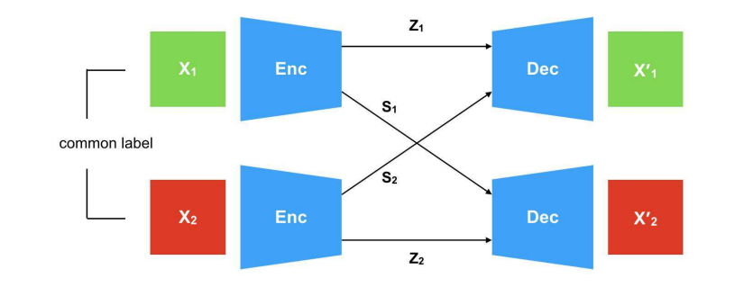
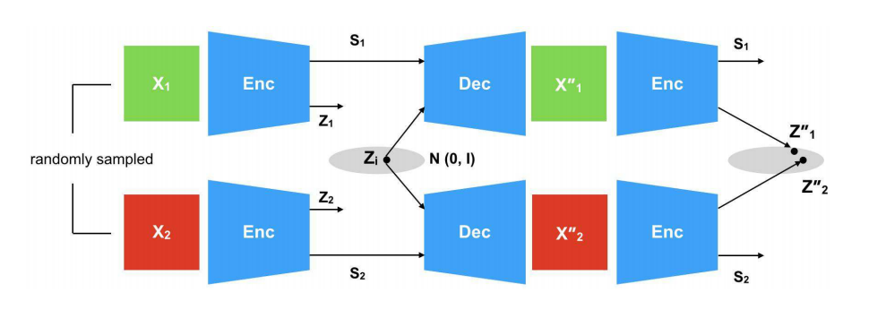
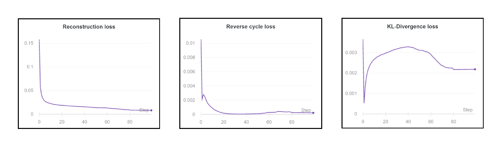
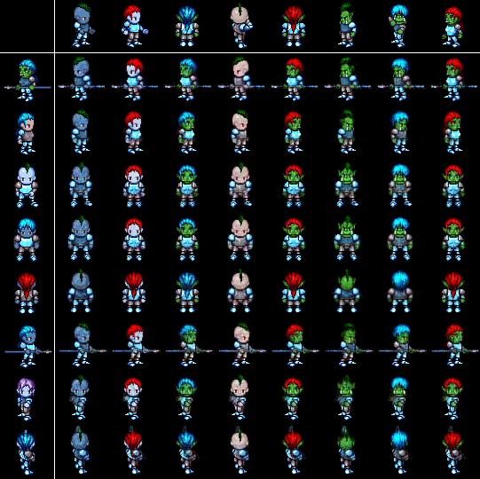
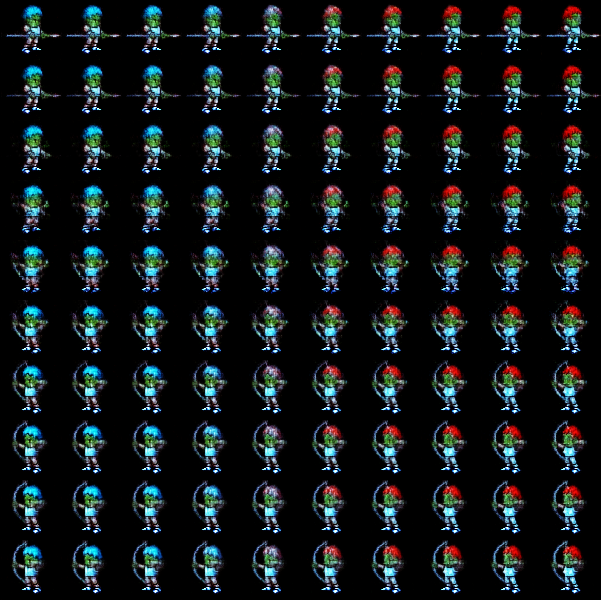
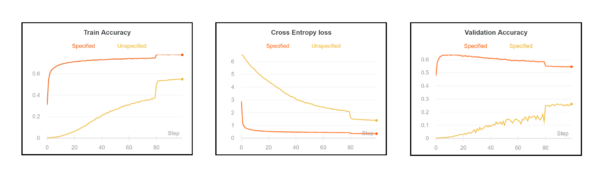
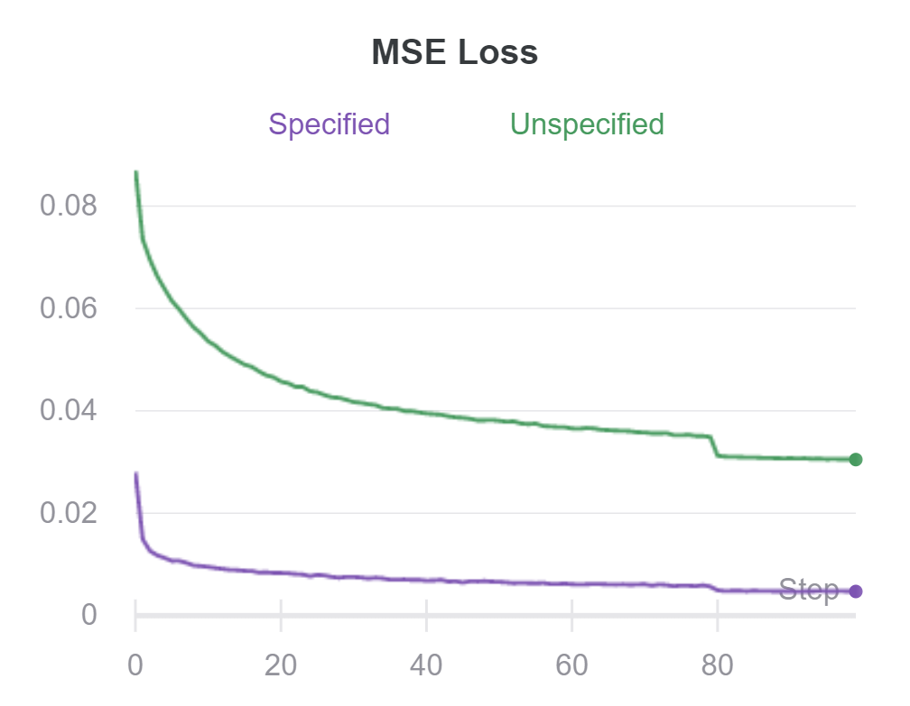

# Cycle Consistent VAE

This is the code  for *Cycle Consistent VAE* ([ECCV](http://openaccess.thecvf.com/content_ECCV_2018/papers/Ananya_Harsh_Jha_Disentangling_Factors_of_ECCV_2018_paper.pdf)).


Official Code Repo - [Github](https://github.com/ananyahjha93/cycle-consistent-vae)

## Architecture

### Forward Cycle


<p align="center">
  
</p>


### Reverse Cycle


<p align="center">
  
</p>


## Installation

Use the package manager [pip](https://pip.pypa.io/en/stable/) to install all required libraries.


```bash
pip install requirements.txt 
```

or

```bash

conda create --name <env> --file requirements.txt 
```


## Training
All the models are train on 2D Sprites Dataset.

### Autoencoder

For training the autoencoer use `main_vae.py`


### Classifier Model

For training classifier based specified and unspecified  use `main_classifier.py`

### Prediction Model
For training prediction based specified and unspecified  use  `main_prediction.py`


## Results

### Autoencoder




#### Style transfer output

<p align="center">
  
</p>


#### Linear Interpolation

<p align="center">
  
</p>


### Classifier Model Training


<p align="center">
  
</p>

<!-- ### Prediction Model Training

 -->


## Contributing
Pull requests are welcome. For major changes, please open an issue first to discuss what you would like to change.


